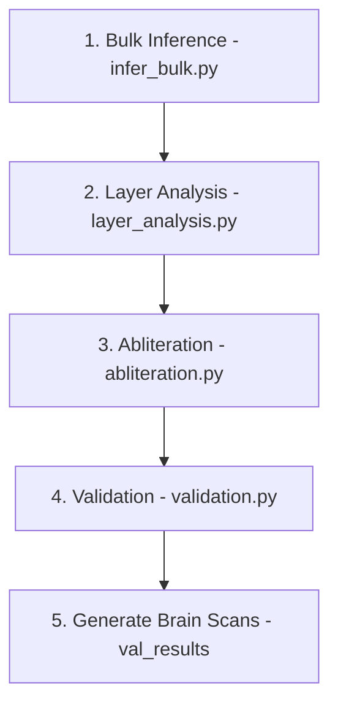

# TRIBE v2 Concept Abliteration Pipeline

A fully data-driven pipeline for surgeon-like concept suppression or tolerance inside the TRIBE v2 brain model, featuring Leave-One-Subject-Out (LOSO) contrast designs, multi-layer weight surgery, and automated checkpoint chunking.

---

## 🚀 Setup & Installation

This repo is **~10.7GB**: the chunked abliterated checkpoints and the prediction
set. How you clone depends on what you need.

**Just the code** (measured: **5 seconds, 1.3MB on disk**):
```bash
git clone --filter=blob:none --no-checkout --depth 1 https://github.com/aloshdenny/janice-stfu.git
cd janice-stfu
git sparse-checkout set scripts README.MD requirements.txt
git checkout main
```
`--no-checkout` is the part that matters. `--filter=blob:none` alone still checks
out every file, so git lazily fetches all the blobs anyway and you wait just as
long. Skipping the checkout and sparse-setting first is what makes it fast.

**Everything, including the checkpoints and predictions** (slow, plan for it):
```bash
git clone https://github.com/aloshdenny/janice-stfu.git
```
Or start sparse as above and pull the rest later with `git sparse-checkout disable`.

**Then:**
```bash
conda activate tribev2          # or any Python 3.11 env
pip install -r requirements.txt
python scripts/verify_reproducible.py    # exit 0 = this clone will run
```

> **Chunked artifacts**: the abliterated `.pt` checkpoints are ~4.14GB each, over
> GitHub's 100MB file limit, so they are committed as `{stem}_chunk_NNN.pt` parts
> and the fused file **does not exist** after a clone. Always go through
> `scripts/chunk_utils.py` -- `save_chunked`/`load_chunked` for checkpoints,
> `save_npz`/`load_npz`/`npz_exists` for arrays, `ensure_fused_zip` for image
> zips, `chunk_file_if_needed` for anything else -- rather than a bare
> `torch.load` / `np.load` / `Path.exists`, which silently find nothing.
> `verify_reproducible.py` enforces this.

---

## 📂 Data Layout

The pipeline automatically discovers categories from subfolders under `data/`. Categories are not hardcoded. Adding a new directory automatically integrates it into the pipeline.

```
data/
  ├── argument/     # ~48 videos, 30s each, 256x256
  ├── butcher/
  ├── chase/
  ├── cute/
  ├── dance/
  ├── fight/
  ├── food/
  ├── gore/
  ├── kissing/
  ├── nature/
  ├── porn/         # Target or baseline
  ├── sports/
  └── surgery/
```

- **Current categories (13)**: `argument`, `butcher`, `chase`, `cute`, `dance`, `fight`, `food`, `gore`, `kissing`, `nature`, `porn`, `sports`, `surgery`.
- **Target Specification**: The target concept is specified at runtime (e.g. `--target porn`). All other discovered categories automatically serve as baseline controls.

---

## ⚙️ Abliteration Pipeline

The dependency chain is fully linear and runs via four sequential scripts:



### 1. Bulk Inference
Precomputes and saves model predictions (`preds.npy`) for all videos. Already-processed videos are skipped.
```bash
python scripts/infer_bulk.py
```

### 2. Layer Analysis
Analyzes representations layer-by-layer to generate masks and identify which transformer layers are most selective for the target concept. Output is saved to `tribe_study/masks/layer_profiles.npz` along with diagnostic plots in `analysis/`.
```bash
python scripts/layer_analysis.py
```

### 3. Concept Abliteration (Surgery)
Extracts PCA concept directions and applies surgical suppression/tolerance to the selected encoder layers. 
```bash
# Run surgery with 5 operated layers and 3 components per layer
python scripts/abliteration.py --target porn --tolerance -1.0 --n_components 3 --n_layers 5
```

### 4. Validation
Loads the abliterated model, clears inference caches, compares predictions against baseline outputs, and saves side-by-side brain scan visualization PNGs to `val_results/`.
```bash
python scripts/validation.py --target porn
```

---

## 💾 Checkpoint Chunking & Versioning

Because the abliterated PyTorch checkpoints (`.pt`) are extremely large (~4.14 GB each) and GitHub enforces a strict **100MB file limit** and a **2GB push size limit**:
- **Automatic Chunking**: Checkpoints are automatically sliced into binary chunks of `<25MB` (default is `23 * 1024 * 1024` bytes / 24.12 MB) when saving in `abliteration.py`. They are saved as `vjepa2_abliterated_chunk_000.pt`, `vjepa2_abliterated_chunk_001.pt`, etc.
- **Helpers**: use `scripts/chunk_utils.py` rather than reading these files directly --
  `save_chunked`/`load_chunked` for `.pt` checkpoints, `save_npz`/`load_npz`/`npz_exists`
  for arrays, `ensure_fused_zip` for image zips, and `chunk_file_if_needed` for anything
  else. The fused file does **not** exist after a clone, only the parts do.
- **On-Disk Re-fusing**: When loaded in `validation.py`, these chunks are merged into a temporary file on disk, read via `torch.load()`, and immediately deleted to ensure memory safety on 16GB RAM machines.
- **Pushing large histories**: GitHub also rejects a single pack much over ~2GB, so a
  first push of this repo has to go in increments (push progressively later commits,
  rather than the whole history at once) instead of one `git push`.
- **Verify before pushing**: `python scripts/verify_reproducible.py` checks nothing
  exceeds the 100MB limit, that every chunk set actually re-fuses, and that no script
  reads a chunked artifact with a raw `torch.load`/`np.load`/`Path.exists`, which would
  silently find nothing in a fresh clone. Exit 0 means a fresh clone will run.

---

## 🧠 Methodology & Concepts

### 1. Contrast Design — Leave-One-Subject-Out (LOSO)
Rather than comparing against static arbitrary reference frames, every category is contrasted against all other categories in a fully data-driven configuration:
- **LOSO contrast** = `category − mean(all other categories)`
- **LOSO-k contrast** = `category − mean(all others except category k)` (isolates confounding signals)
- **Multivariate Mask** = Vertices where the target category activation is strictly greater than every other category.

### 2. Selectivity Mask Scoring
Selectivity masks are isolated using margin-based selection:
$$\text{Score} = \text{Min Margin} \times \text{Selectivity}$$
$$\text{where } \text{Min Margin} = \text{Target Activation} - \text{Max Competitor Activation}$$
This guarantees that vertices where the target activation only marginally exceeds competitor activation score near zero, while vertices with clear target dominance score high.

### 3. Multi-Layer Surgery
`--n_layers N` selects the top-N layers from `layer_profiles.npz` based on concept correlation. Activations are collected per-layer, PCA directions are calculated independently per-layer, and surgery is applied independently using layer-specific directions.
- Directory of directions: `abliterated/{target}_directions_L{layer_idx}.npy`
- Surgery log: `abliterated/surgery_log.json` (lists operated layers; parsed automatically by the validation loop)

### 4. Tolerance Scale
Continuous scale mapping surgeon intervention outcomes:
```
  -1       -0.5       0       +0.5       +1
   |--------|---------|---------|--------|
   Repulsion Aversion  Neutral  Acceptance Attraction
```
- **Tolerance < 0**: Suppress / repel the concept.
- **Tolerance = 0**: Neutral (no effect).
- **Tolerance > 0**: Accept / tolerate the concept.
> **Note**: Positive tolerance represents the absence of aversion (no pushback), not a preference for the concept.

---

## 🛠️ Troubleshooting

### Deadlock on Cache Access
If multi-process file locks deadlock, remove the inflight database in your cache directory:
```bash
find ./cache -name "inflight.db" -delete
```